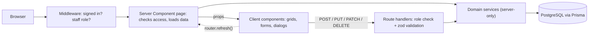

# A Plus TJ

**A web app for running a cram school (an after-school tutoring center).** Owners and staff use it to manage classes, students, parents, teachers, class sessions, attendance, and homework in one place instead of spreadsheets and paper sign-in sheets.

## Why it exists

A small tutoring school juggles a lot of moving parts: which students are in which class, when each class meets, who showed up this week, and what homework is due. That information usually lives in scattered spreadsheets, so answering simple questions ("Who missed Wednesday's English class?", "Which assignments are overdue?") takes real effort.

A Plus keeps that information in one database behind a staff-only web interface:

- **Owners/administrators** manage people, classes, schedules, and assignments.
- **Teachers** can look everything up without being able to change it.
- Anyone else who signs in is turned away.

## Key features

- **Class management**: create classes with a teacher, grade level, capacity, and weekly timetable, and see at a glance how full each class is.
- **Student, parent, and staff directories**: searchable, sortable tables with CSV export; student and staff profiles with school, enrollment, and contact details (email and phone are clickable).
- **Class sessions**: schedule individual class meetings, reschedule or delete them, and filter by the last 7 days, this month, or year to date.
- **Attendance**: a weekly grid per class showing who was present or absent at each session, with week-by-week navigation; each session also has a page listing who attended and who was absent.
- **Assignments**: create, edit, and delete homework for a class, and switch between all, upcoming, and past-due assignments.
- **Settings**: add grade levels and staff roles.
- **Secure staff access**: staff sign in with their Google account; access and edit rights come from each person's role.

**Still in progress:**

- Billing pages are placeholders, and changing a student's class enrollment isn't implemented yet.
- The dashboard and the schedule calendar show sample data.

There is no public demo deployment or screenshots in the repository yet.

## Technical overview

| Area           | Technology                                                                                                                    |
| -------------- | ----------------------------------------------------------------------------------------------------------------------------- |
| Frontend       | Next.js 13.5 (App Router), React 18, TypeScript (strict), MUI 5, MUI X Data Grid and Date Pickers, react-big-calendar, Day.js |
| Backend        | Next.js Server Components for reads, Route Handlers for writes, zod validation                                                |
| Database       | PostgreSQL with Prisma ORM (schema and migrations in `prisma/`)                                                               |
| Authentication | NextAuth.js with Google OAuth and JWT sessions; roles assigned from environment allowlists                                    |
| Infrastructure | Dockerfile and Docker Compose (PostgreSQL 15 + app), GitHub Actions CI                                                        |
| Testing        | Vitest                                                                                                                        |

## Architecture

Pages are **Server Components** that load their data directly from a small service layer. Only interactive pieces (tables, forms, dialogs) run in the browser. When a user changes something, the browser calls a JSON **route handler**, then asks Next.js to re-render the page with fresh server data.



- **Reads:** a page such as `/classes` calls `classService.getAll()` on the server and renders the list. The browser never fetches that data separately.
- **Writes:** the "New Class" dialog sends `POST /api/classes`. The handler authorizes the user, validates the body, calls `classService.create()`, and returns the created record or `{ error, details }`.
- **Filters** (session date range, assignment status, attendance week) live in the URL, so every view is linkable and survives a refresh.

## Engineering highlights

- **Layered authorization.** Middleware turns away anyone who isn't signed-in staff. Each page and each route handler checks the role again (`requirePageAccess`, `authorize`), so no single check is load-bearing. Roles come from `AUTH_ADMIN_EMAILS` / `AUTH_TEACHER_EMAILS` and are covered by tests.
- **Validation and consistent errors.** Every write is validated with zod. Errors map to the right HTTP status (400, 401, 403, 404, 409) with a `{ error, details }` body; database constraint violations become readable 409/404 responses. Unexpected errors return a generic 500 without leaking internals.
- **Server/client boundary.** Database code is marked `server-only`, so it can't end up in the browser bundle, and pages pass plain data down to small client components.
- **Types derived from queries.** Prisma `include`/`select` configs double as the source of domain types (`Prisma.ClassGetPayload<…>`), so the UI's types always match what the query returns. TypeScript runs in `strict` mode.
- **Date handling.** Date-only fields (birthdays, due dates) are stored as UTC midnight and formatted in UTC, and date pickers convert to `YYYY-MM-DD` without timezone shifts. The tests run in the Asia/Taipei timezone, where a naive conversion would move dates back a day.
- **Reusable UI:**
  - `FormDialog` keeps its form state inside the dialog, so every opening starts fresh, and it blocks double submits.
  - `ConfirmDialog` handles destructive actions.
  - `LinkTabs` makes each tab a real URL.
  - Person tables share one column definition.
- **Accessibility.** Dialogs are labelled, icon-only buttons have names, tabs and contact details are real links, and there are no decorative "buttons" that do nothing.

## Project structure

```text
src/
  app/                 Routes (App Router)
    api/**/route.ts    JSON endpoints for create/update/delete
    persons/…          Students, parents, staff (list + detail layouts with tabs)
    classes/ sessions/ attendance/ assignments/ billing/ settings/ …
    layout.tsx         Root layout: providers + app shell
  modules/<domain>/    Feature code, one folder per domain
    *.service.ts       Server-only data access (Prisma)
    schema.ts          zod input validation
    types.ts           Query configs and domain types
    components/        Client UI for the domain
  components/          Shared UI (FormDialog, ConfirmDialog, DataGrid, layout, navigation)
  hooks/               Shared client hooks (API mutations, pending-action guard)
  lib/                 Auth, API error handling, validation and date helpers, Prisma client
  middleware.ts        Sign-in and role gate for pages and API
prisma/                Database schema and migrations
```

## Getting started

### Prerequisites

- Node.js 20 or newer, and npm
- PostgreSQL (the included Docker Compose file can run PostgreSQL 15 for you)
- A Google OAuth client for sign-in ([Google Cloud Console](https://console.cloud.google.com/apis/credentials)) with the redirect URI `http://localhost:3000/api/auth/callback/google`

### Setup

```bash
npm install
cp .env.example .env
```

Fill in `.env` (both Next.js and the Prisma CLI read it):

| Variable                                   | Purpose                                                                          |
| ------------------------------------------ | -------------------------------------------------------------------------------- |
| `DATABASE_URL`                             | PostgreSQL connection string                                                     |
| `NEXTAUTH_URL`, `NEXTAUTH_SECRET`          | NextAuth base URL and signing secret (`openssl rand -base64 32`)                 |
| `GOOGLE_CLIENT_ID`, `GOOGLE_CLIENT_SECRET` | Google OAuth credentials                                                         |
| `AUTH_ADMIN_EMAILS`, `AUTH_TEACHER_EMAILS` | Comma-separated emails, or `@domain` entries, that get the admin or teacher role |

Start a database (or point `DATABASE_URL` at an existing one), then apply the migrations:

```bash
docker compose up -d pg
npx prisma migrate deploy
```

### Run

```bash
npm run dev          # http://localhost:3000
```

### Test and verify

```bash
npm test             # Vitest unit tests
npm run typecheck    # TypeScript
npm run lint         # ESLint (next/core-web-vitals)
npm run build        # Production build (runs prisma generate first)
npm start            # Serve the production build
```

GitHub Actions runs the type check, lint, tests, and build on every push to `main` and on pull requests.

## Engineering decisions

- **Route handlers for writes instead of Server Actions.** In Next.js 13.5, Server Actions are still experimental. Route handlers are stable, give the app an explicit HTTP API with real status codes, and keep authorization and validation in one obvious place per endpoint.
- **Roles from environment allowlists.** The schema has no user accounts table, and a small school has a handful of staff. Allowlists (including whole-domain entries) keep access control declarative and need no admin screen. A role change takes effect the next time the user's session refreshes, without a code change.
- **Feature folders over layer folders.** Everything about classes (queries, validation, types, UI) sits in `src/modules/classes`. Barrel files export only types and schemas, never server code, so client components can import from them safely.
- **Server-rendered data, client-side interactivity.** Most pages ship no data-fetching code at all. The trade-off is a server round trip after each change (`router.refresh()`), which is fine for an internal tool with modest data volumes.

## Future improvements

- **Billing:** tuition records and payments. The database tables exist; the UI is still a placeholder.
- **Enrollment:** enrolling students in, and removing them from, classes from the student page.
- **Real data** on the dashboard and schedule calendar, driven by class sessions.
- **Upgrade** to a current Next.js/React release and move mutations to Server Actions.
- **End-to-end tests** (for example Playwright) for the main create/edit flows, plus screenshots or a demo deployment.
